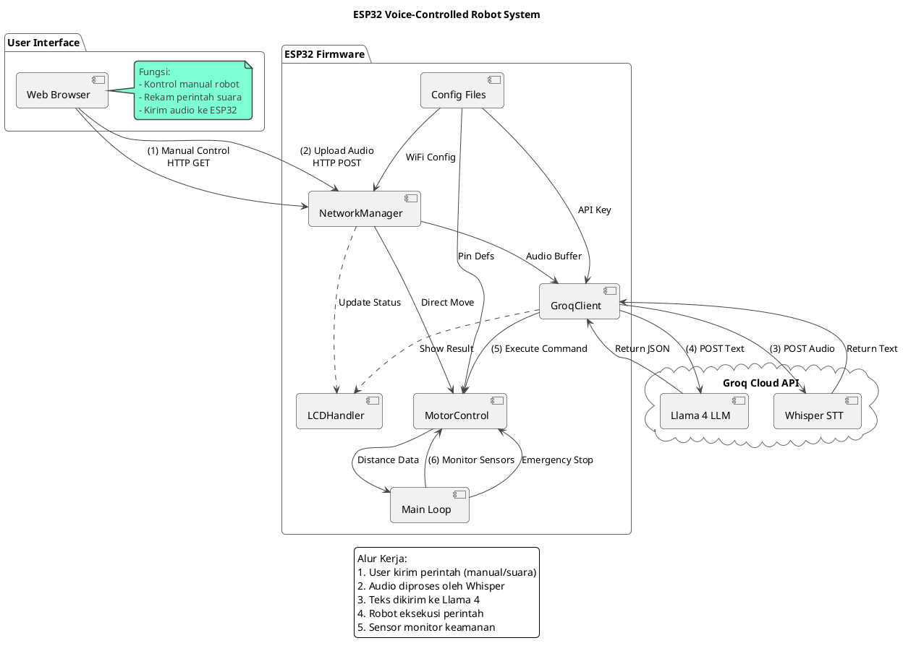

---

# ESP32 AI Voice Robot (Groq API + Core v3.0)

A modular, voice-controlled robot powered by the ESP32 and Groq Cloud AI. This project integrates modern ESP32 Arduino Core v3.0 APIs, Asynchronous Web Server, and a robust hardware abstraction layer.

## 🚀 Key Features

*   **Modern ESP32 Core v3.0 Compliance**: Uses the new `ledcAttach` and `ledcWrite` APIs, abandoning deprecated drivers.
*   **AI Voice Control**: Records audio via browser, processes Speech-to-Text (Whisper) and Intent Recognition (Llama 3) via **Groq API**.
*   **Modular Architecture**: Clean separation of concerns using `.h` and `.cpp` files.
*   **Reactive Web UI**: Gamepad-style control and voice recorder hosted directly on the ESP32.
*   **Safety First**: Dedicated obstacle avoidance loop running independently of the web server.

## 🛠 Hardware Requirements

*   **Microcontroller**: ESP32 Dev Module (Doit ESP32 DEVKIT V1 recommended).
*   **Motor Driver**: L298N.
*   **Sensors**: 2x HC-SR04 Ultrasonic Sensors (Front & Back).
*   **Display**: LCD 1602 with I2C Backpack.
*   **Chassis**: 2WD or 4WD Robot Chassis.
*   **Power**: 2x 18650 Li-ion batteries (recommended).

## 📂 Module Architecture

The code is refactored into specific modules to ensure maintainability. Here is how they interact:

| Module | File(s) | Responsibility |
| :--- | :--- | :--- |
| **Main** | `*.ino` | **Orchestrator**. Initializes all modules and runs the safety loop to check sensors. |
| **Config** | `Config.h` | **Source of Truth**. Contains permanent pin definitions, API URLs, and global constants. |
| **Env** | `env.h` | **Security**. Stores WiFi credentials and API Keys (Not uploaded to Git). |
| **Motor** | `MotorControl` | **Hardware Layer**. Handles PWM (LEDC) generation and ultrasonic sensor readings. |
| **Network** | `NetworkManager` | **Connectivity**. Manages WiFi connection, Web Server, and serving the HTML UI. |
| **AI** | `GroqClient` | **Intelligence**. Handles HTTPS requests to Groq (Whisper for audio, Llama 3 for logic). |
| **Display** | `LCDHandler` | **Feedback**. Provides visual status updates to the user. |

---

## 📊 System Architecture (PlantUML)




### Flow Explanation
1.  **Manual Control**: The Web Interface sends HTTP GET requests directly to `NetworkManager`, which calls `MotorControl`.
2.  **Voice Control**:
    *   Audio is recorded in the browser and sent to `NetworkManager`.
    *   `NetworkManager` buffers the audio and passes it to `GroqClient`.
    *   `GroqClient` sends audio to **Whisper**, gets text, sends text to **Llama 3**, and receives a JSON command (e.g., `{"command": "turn_left", "angle": 90}`).
    *   `GroqClient` parses the JSON and instructs `MotorControl` to move.
3.  **Safety Loop**: The `Main` loop constantly polls `MotorControl` for distance data. If an object is too close, it overrides all other commands and stops the robot.

---

## ⚙️ Installation & Setup

1.  **Clone the Repository**
    ```bash
    git clone https://github.com/username/esp32-groq-robot.git
    ```

2.  **Configure Environment**
    *   Locate the file `env_template.h`.
    *   Rename it to `env.h`.
    *   **IMPORTANT**: Add `env.h` to your `.gitignore` file to prevent leaking passwords.
    *   Edit `env.h` with your credentials:
        ```cpp
        const char* WIFI_SSID = "Your_WiFi_Name";
        const char* WIFI_PASS = "Your_WiFi_Password";
        const char* GROQ_API_KEY = "gsk_YourRealGroqKeyHere";
        ```

3.  **Pin Configuration**
    *   Check `Config.h` and ensure the pin definitions match your wiring.
    *   *Note*: The pins in the code are hardcoded for standard ESP32 layouts but can be adjusted in this file if necessary.

4.  **Upload**
    *   Open `ESP32_Robot_Groq.ino` in Arduino IDE.
    *   Select Board: **ESP32 Dev Module**.
    *   Install Libraries:
        *   `ESPAsyncWebServer`
        *   `AsyncTCP`
        *   `ArduinoJson`
        *   `LiquidCrystal_I2C`
    *   Compile and Upload.

## 📝 License

Distributed under the MIT License. See `LICENSE` for more information.

---
**Disclaimer**: This project relies on the Groq API. Ensure you have a valid API Key and a stable internet connection for voice features to work.
```
